TMR in Belgium & the Netherlands
================

  - [Statistical analysis preface](#statistical-analysis-preface)
  - [Data extraction, transformation and
    loading](#data-extraction-transformation-and-loading)
      - [TMR Data](#tmr-data)
          - [Making a new matrix with the means, cv,
            orts](#making-a-new-matrix-with-the-means-cv-orts)
          - [Check normality](#check-normality)
      - [SURVEY](#survey)
      - [Making a new matrix with TMR and SURVEY + data
        manipulation](#making-a-new-matrix-with-tmr-and-survey-data-manipulation)
  - [Principal Component Analysis
    TMR](#principal-component-analysis-tmr)
  - [Regression Tree TMR + SURVEY](#regression-tree-tmr-survey)
      - [PC1](#pc1)
      - [PC2](#pc2)
  - [Factor Analysis of Mixed Data TMR +
    SURVEY](#factor-analysis-of-mixed-data-tmr-survey)
      - [visualisations](#visualisations)
  - [MPR + ENQ](#mpr-enq)
      - [Making a new matrix with MPR and SELECTED SURVEY
        VARIABLES](#making-a-new-matrix-with-mpr-and-selected-survey-variables)
      - [visualisations](#visualisations-1)

# Statistical analysis preface

Currently the following R packages were loaded

``` r
library(readxl)

library("reshape2")

library("matrixStats")

library(rpart)

library(rattle)
```

    ## Rattle: A free graphical interface for data science with R.
    ## Version 5.2.0 Copyright (c) 2006-2018 Togaware Pty Ltd.
    ## Type 'rattle()' to shake, rattle, and roll your data.

``` r
library(rpart.plot)

library(RColorBrewer)

library("FactoMineR")

library("factoextra")
```

    ## Loading required package: ggplot2

    ## Welcome! Related Books: `Practical Guide To Cluster Analysis in R` at https://goo.gl/13EFCZ

``` r
library("lme4") 
```

    ## Loading required package: Matrix

``` r
library("ggplot2")
```

# Data extraction, transformation and loading

## TMR Data

``` r
TMR <- read.csv2("TMRAudits.csv")
TMR$Total <- NULL
TMR$Quantity <- NULL

TMR_wide <- dcast(TMR, Herd + Sieve ~ Sample) ## reshape table - wide format
```

    ## Using Fraction as value column: use value.var to override.

``` r
TMR_wide[TMR_wide == "0"] <- NA

TMR_wide$mean <- rowMeans(TMR_wide[,3:12], na.rm = TRUE) ## Mean Sample 1 - 10

TMR_wide$diff <- (TMR_wide$refusals - TMR_wide$mean)/TMR_wide$mean ## relative difference between mean and orts

TMR_matrix <- as.matrix(TMR_wide[,3:12])
TMR_wide$sd <- rowSds(TMR_matrix, na.rm = TRUE) ## Standard deviation

CV <- function(mean, sd) { (sd/mean)*100 }
TMR_wide$cv <- CV(mean = TMR_wide$mean, sd = TMR_wide$sd) ## Coefficient of variation in TMR_wide$cv
```

### Making a new matrix with the means, cv, orts

``` r
Herd <- matrix(TMR_wide$Herd, ncol = 3, byrow=TRUE)
colnames(Herd) <- c("Herd1","Herd2", "Herd")

mean <- matrix(TMR_wide$mean, ncol = 3, byrow = TRUE)
colnames(mean) <- c("FRESH.mid.mean","FRESH.pan.mean", "FRESH.top.mean")

cv <- matrix(TMR_wide$cv, ncol = 3, byrow = TRUE)
colnames(cv) <- c("FRESH.mid.cv","FRESH.pan.cv", "FRESH.top.cv")

diff <- matrix(TMR_wide$diff, ncol = 3, byrow = TRUE)
colnames(diff) <- c("REFUSALS.mid","REFUSALS.pan", "REFUSALS.top")

TMR_table <- data.frame(Herd, mean, cv, diff)
TMR_table <- na.omit(TMR_table[,3:12])
```

``` r
summary(TMR_table)
```

    ##       Herd    FRESH.mid.mean   FRESH.pan.mean   FRESH.top.mean   
    ##  Herd 1 : 1   Min.   :0.1571   Min.   :0.2523   Min.   :0.01517  
    ##  Herd 10: 1   1st Qu.:0.3018   1st Qu.:0.3400   1st Qu.:0.16129  
    ##  Herd 11: 1   Median :0.3858   Median :0.3962   Median :0.21991  
    ##  Herd 12: 1   Mean   :0.3748   Mean   :0.3970   Mean   :0.22818  
    ##  Herd 13: 1   3rd Qu.:0.4266   3rd Qu.:0.4643   3rd Qu.:0.28163  
    ##  Herd 14: 1   Max.   :0.5444   Max.   :0.5586   Max.   :0.59068  
    ##  (Other):60                                                      
    ##   FRESH.mid.cv     FRESH.pan.cv     FRESH.top.cv    REFUSALS.mid      
    ##  Min.   : 1.727   Min.   : 2.952   Min.   : 5.82   Min.   :-0.632586  
    ##  1st Qu.: 6.189   1st Qu.: 5.174   1st Qu.:16.84   1st Qu.:-0.114812  
    ##  Median : 9.906   Median : 6.998   Median :21.74   Median :-0.003755  
    ##  Mean   :11.562   Mean   : 9.041   Mean   :27.43   Mean   :-0.013108  
    ##  3rd Qu.:13.500   3rd Qu.: 8.777   3rd Qu.:30.56   3rd Qu.: 0.100569  
    ##  Max.   :45.808   Max.   :38.762   Max.   :95.02   Max.   : 0.427621  
    ##                                                                       
    ##   REFUSALS.pan      REFUSALS.top     
    ##  Min.   :-0.8495   Min.   :-0.36583  
    ##  1st Qu.:-0.2304   1st Qu.:-0.00748  
    ##  Median :-0.1644   Median : 0.24460  
    ##  Mean   :-0.1708   Mean   : 0.34779  
    ##  3rd Qu.:-0.0671   3rd Qu.: 0.60225  
    ##  Max.   : 0.1382   Max.   : 1.61444  
    ## 

``` r
sd(TMR_table$FRESH.pan.mean)
```

    ## [1] 0.07968879

``` r
sd(TMR_table$FRESH.mid.mean)
```

    ## [1] 0.08526356

``` r
sd(TMR_table$FRESH.top.mean)
```

    ## [1] 0.1129194

``` r
sd(TMR_table$FRESH.pan.cv)
```

    ## [1] 6.855499

``` r
sd(TMR_table$FRESH.mid.cv)
```

    ## [1] 8.58317

``` r
sd(TMR_table$FRESH.top.cv)
```

    ## [1] 18.02287

``` r
sd(TMR_table$REFUSALS.pan)
```

    ## [1] 0.1730275

``` r
sd(TMR_table$REFUSALS.mid)
```

    ## [1] 0.1887519

``` r
sd(TMR_table$REFUSALS.top)
```

    ## [1] 0.4695364

### Check normality

``` r
TMR_table$FRESH.top.cv <- log(TMR_table$FRESH.top.cv)
TMR_table$FRESH.mid.cv <- log(TMR_table$FRESH.mid.cv)
TMR_table$FRESH.pan.cv <- log(TMR_table$FRESH.pan.cv)
TMR_table$REFUSALS.top <- log(TMR_table$REFUSALS.top +1)

par(mfrow = c(3,3))
hist(TMR_table$FRESH.top.mean)
hist(TMR_table$FRESH.mid.mean)
hist(TMR_table$FRESH.pan.mean)
hist(TMR_table$FRESH.top.cv)
hist(TMR_table$FRESH.mid.cv)
hist(TMR_table$FRESH.pan.cv)
hist(TMR_table$REFUSALS.top)
hist(TMR_table$REFUSALS.mid)
hist(TMR_table$REFUSALS.pan)
```

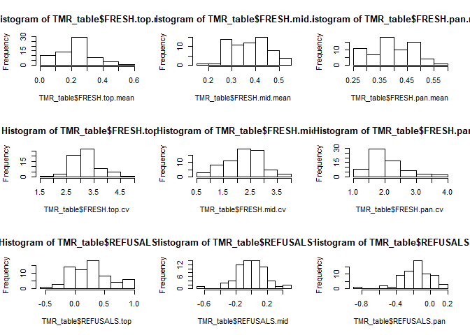<!-- -->

``` r
par(mfrow = c(3,3))
shapiro.test(TMR_table$FRESH.top.mean)
```

    ## 
    ##  Shapiro-Wilk normality test
    ## 
    ## data:  TMR_table$FRESH.top.mean
    ## W = 0.95843, p-value = 0.02663

``` r
qqnorm(TMR_table$FRESH.top.mean); qqline(TMR_table$FRESH.top.mean)
shapiro.test(TMR_table$FRESH.mid.mean)
```

    ## 
    ##  Shapiro-Wilk normality test
    ## 
    ## data:  TMR_table$FRESH.mid.mean
    ## W = 0.97166, p-value = 0.1351

``` r
qqnorm(TMR_table$FRESH.mid.mean); qqline(TMR_table$FRESH.mid.mean)
shapiro.test(TMR_table$FRESH.pan.mean)
```

    ## 
    ##  Shapiro-Wilk normality test
    ## 
    ## data:  TMR_table$FRESH.pan.mean
    ## W = 0.97137, p-value = 0.1304

``` r
qqnorm(TMR_table$FRESH.pan.mean); qqline(TMR_table$FRESH.pan.mean)
shapiro.test(TMR_table$FRESH.top.cv)
```

    ## 
    ##  Shapiro-Wilk normality test
    ## 
    ## data:  TMR_table$FRESH.top.cv
    ## W = 0.96019, p-value = 0.03296

``` r
qqnorm(TMR_table$FRESH.top.cv); qqline(TMR_table$FRESH.top.cv)
shapiro.test(TMR_table$FRESH.mid.cv)
```

    ## 
    ##  Shapiro-Wilk normality test
    ## 
    ## data:  TMR_table$FRESH.mid.cv
    ## W = 0.98678, p-value = 0.7091

``` r
qqnorm(TMR_table$FRESH.mid.cv); qqline(TMR_table$FRESH.mid.cv)
shapiro.test(TMR_table$FRESH.pan.cv)
```

    ## 
    ##  Shapiro-Wilk normality test
    ## 
    ## data:  TMR_table$FRESH.pan.cv
    ## W = 0.90304, p-value = 8.214e-05

``` r
qqnorm(TMR_table$FRESH.pan.cv); qqline(TMR_table$FRESH.pan.cv)
shapiro.test(TMR_table$REFUSALS.top)
```

    ## 
    ##  Shapiro-Wilk normality test
    ## 
    ## data:  TMR_table$REFUSALS.top
    ## W = 0.97955, p-value = 0.3464

``` r
qqnorm(TMR_table$REFUSALS.top); qqline(TMR_table$REFUSALS.top)
shapiro.test(TMR_table$REFUSALS.mid)
```

    ## 
    ##  Shapiro-Wilk normality test
    ## 
    ## data:  TMR_table$REFUSALS.mid
    ## W = 0.9762, p-value = 0.2346

``` r
qqnorm(TMR_table$REFUSALS.mid); qqline(TMR_table$REFUSALS.mid)
shapiro.test(TMR_table$REFUSALS.pan)
```

    ## 
    ##  Shapiro-Wilk normality test
    ## 
    ## data:  TMR_table$REFUSALS.pan
    ## W = 0.94077, p-value = 0.003462

``` r
qqnorm(TMR_table$REFUSALS.pan); qqline(TMR_table$REFUSALS.pan)
```

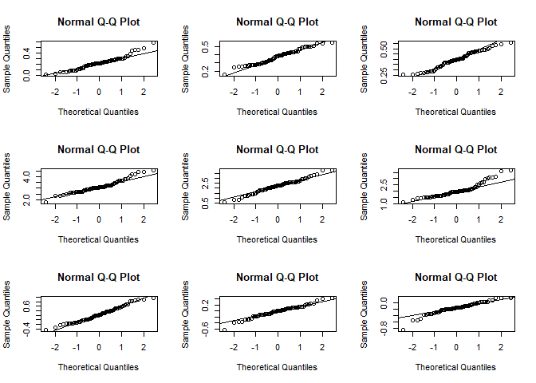<!-- -->

## SURVEY

``` r
ENQ_data <- read.csv2("SURVEY.csv")
```

## Making a new matrix with TMR and SURVEY + data manipulation

``` r
DATASET1 <- merge(TMR_table, ENQ_data, by.x = "Herd", by.y = "HERD", all = FALSE)

DATASET1$CONSERVATION_SCORE <- as.factor(DATASET1$CONSERVATION_SCORE)
DATASET1$CONSERVATION <- as.factor(DATASET1$CONSERVATION)
DATASET1$SPOILAGE <- as.factor(DATASET1$SPOILAGE)
DATASET1$SCRAPING_SCORE <- as.factor(DATASET1$SCRAPING_SCORE)
DATASET1$SCRAPING <- as.factor(DATASET1$SCRAPING)
DATASET1$HOR_VERT_DRUM <- as.factor(DATASET1$HOR_VERT_DRUM)
DATASET1$AUGER_SCORE <- as.factor(DATASET1$AUGER_SCORE)
DATASET1$AUGER <- as.factor(DATASET1$AUGER)
DATASET1$KNIVES_SCORE <- as.factor(DATASET1$KNIVES_SCORE)
DATASET1$KNIVES <- as.factor(DATASET1$KNIVES)
DATASET1$HAY_PROCESSING <- as.factor(DATASET1$HAY_PROCESSING)
DATASET1$POSITION <- as.factor(DATASET1$POSITION)
DATASET1$MIXING_START <- as.factor(DATASET1$MIXING_START)
DATASET1$MIXING_AFTER_LAST_MIN <- as.factor(DATASET1$MIXING_AFTER_LAST_MIN)
DATASET1$MIXING_AFTER_LAST <- as.factor(DATASET1$MIXING_AFTER_LAST)
DATASET1$LIQUID <- as.factor(DATASET1$LIQUID)
DATASET1$FILLING <- as.factor(DATASET1$FILLING)
DATASET1$RPM <- as.factor(DATASET1$RPM)
DATASET1$RPM_2 <- as.factor(DATASET1$RPM_2)
DATASET1$MOVEMENT_SCORE <- as.factor(DATASET1$MOVEMENT_SCORE)
DATASET1$MOVEMENT <- as.factor(DATASET1$MOVEMENT)
DATASET1$EMPTY <- as.factor(DATASET1$EMPTY)
```

``` r
summary(DATASET1)
```

    ##       Herd    FRESH.mid.mean   FRESH.pan.mean   FRESH.top.mean   
    ##  Herd 1 : 1   Min.   :0.1571   Min.   :0.2523   Min.   :0.01517  
    ##  Herd 10: 1   1st Qu.:0.3063   1st Qu.:0.3364   1st Qu.:0.14807  
    ##  Herd 11: 1   Median :0.3883   Median :0.3968   Median :0.21862  
    ##  Herd 12: 1   Mean   :0.3780   Mean   :0.3962   Mean   :0.22580  
    ##  Herd 13: 1   3rd Qu.:0.4295   3rd Qu.:0.4661   3rd Qu.:0.28076  
    ##  Herd 14: 1   Max.   :0.5444   Max.   :0.5586   Max.   :0.59068  
    ##  (Other):57                                                      
    ##   FRESH.mid.cv     FRESH.pan.cv    FRESH.top.cv    REFUSALS.mid      
    ##  Min.   :0.5465   Min.   :1.083   Min.   :1.761   Min.   :-0.632586  
    ##  1st Qu.:1.8130   1st Qu.:1.650   1st Qu.:2.837   1st Qu.:-0.111171  
    ##  Median :2.2506   Median :1.945   Median :3.093   Median :-0.003219  
    ##  Mean   :2.1930   Mean   :2.015   Mean   :3.167   Mean   :-0.014350  
    ##  3rd Qu.:2.6009   3rd Qu.:2.134   3rd Qu.:3.445   3rd Qu.: 0.100412  
    ##  Max.   :3.8025   Max.   :3.657   Max.   :4.554   Max.   : 0.427621  
    ##                                                                      
    ##   REFUSALS.pan       REFUSALS.top       CONSERVATION_SCORE
    ##  Min.   :-0.84947   Min.   :-0.455431   1   : 1           
    ##  1st Qu.:-0.23013   1st Qu.:-0.005714   2   : 3           
    ##  Median :-0.16549   Median : 0.229867   3   : 8           
    ##  Mean   :-0.17404   Mean   : 0.249249   4   :40           
    ##  3rd Qu.:-0.06798   3rd Qu.: 0.463900   5   :10           
    ##  Max.   : 0.13819   Max.   : 0.961052   NA's: 1           
    ##                                                           
    ##             CONSERVATION         SPOILAGE  SCRAPING_SCORE
    ##  Bad conservation :12    No spoilage :34   1   : 2       
    ##  Good conservation:50    Yes spoilage:28   2   :13       
    ##  NA's             : 1    NA's        : 1   3   :17       
    ##                                            4   :18       
    ##                                            5   :12       
    ##                                            NA's: 1       
    ##                                                          
    ##                SCRAPING     HOR_VERT_DRUM      SIZE      AUGER_SCORE
    ##  Not scraped       :32   Horizontal:13    Min.   : 8.0   2   : 8    
    ##  Scraped vertically:30   Vertical  :50    1st Qu.:14.0   3   :10    
    ##  NA's              : 1                    Median :16.0   4   :27    
    ##                                           Mean   :17.1   5   :12    
    ##                                           3rd Qu.:20.0   NA's: 6    
    ##                                           Max.   :30.0              
    ##                                           NA's   :2                 
    ##         AUGER    KNIVES_SCORE         KNIVES   HAY_PROCESSING
    ##  Auger new :39   1   : 6      Knive sharp:29   Hay   :28     
    ##  Auger worn:18   2   : 6      Knive worn :28   No hay:35     
    ##  NA's      : 6   3   :16      NA's       : 6                 
    ##                  4   :18                                     
    ##                  5   :11                                     
    ##                  NA's: 6                                     
    ##                                                              
    ##           POSITION       MIXING_START MIXING_AFTER_LAST_MIN
    ##  Bad position :22   Begin mix  :45    7      : 9           
    ##  Good position:41   End mix    : 7    4      : 7           
    ##                     Halfway mix:11    5      : 7           
    ##                                       2      : 6           
    ##                                       6      : 5           
    ##                                       (Other):28           
    ##                                       NA's   : 1           
    ##                 MIXING_AFTER_LAST       LIQUID          FILLING  
    ##  Mix after last (<5 min) :23      Liquid   :10   Full       :47  
    ##  Mix after last (>9 min) :13      No liquid:53   Overfilled :14  
    ##  Mix after last (5-9 min):26                     Underfilled: 2  
    ##  NA's                    : 1                                     
    ##                                                                  
    ##                                                                  
    ##                                                                  
    ##               RPM                RPM_2    MOVEMENT_SCORE
    ##  Fast (20-30)   :32   Fast (>20 rpm):37   2: 4          
    ##  Slow (10-19)   :21   Slow (<20 rpm):25   3:16          
    ##  Very fast (>30): 5   NA's          : 1   4:39          
    ##  Very slow (<10): 4                       5: 4          
    ##  NA's           : 1                                     
    ##                                                         
    ##                                                         
    ##             MOVEMENT            EMPTY   
    ##  Little movement:20   Empty mixer  :38  
    ##  Movement       :43   Remnant mixer:21  
    ##                       NA's         : 4  
    ##                                         
    ##                                         
    ##                                         
    ## 

# Principal Component Analysis TMR

``` r
TMR.pca <- prcomp(na.omit(DATASET1[,2:10]),
                 center = TRUE,
                 scale. = TRUE) 
print(TMR.pca)
```

    ## Standard deviations (1, .., p=9):
    ## [1] 1.689414e+00 1.510455e+00 1.204156e+00 1.082844e+00 8.792962e-01
    ## [6] 5.057031e-01 3.696036e-01 2.763347e-01 1.001087e-09
    ## 
    ## Rotation (n x k) = (9 x 9):
    ##                        PC1         PC2         PC3         PC4
    ## FRESH.mid.mean -0.39914653 -0.21349813  0.04235691 -0.54924568
    ## FRESH.pan.mean -0.24940674 -0.29090059  0.20417815  0.63108069
    ## FRESH.top.mean  0.47362889  0.36458122 -0.17578283 -0.03641854
    ## FRESH.mid.cv    0.50112658 -0.08855484  0.29405035  0.08637932
    ## FRESH.pan.cv    0.45364895 -0.15186682  0.32708155 -0.24199672
    ## FRESH.top.cv    0.07113749 -0.48958699  0.46637830 -0.24642397
    ## REFUSALS.mid   -0.23269652  0.34886481  0.18476811 -0.32128944
    ## REFUSALS.pan   -0.16057424  0.27150699  0.54187724  0.25674274
    ## REFUSALS.top    0.11061858 -0.52043474 -0.43230857  0.05336399
    ##                         PC5          PC6         PC7          PC8
    ## FRESH.mid.mean  0.304156787 -0.139650213  0.04311547  0.327719121
    ## FRESH.pan.mean -0.347303986  0.159625497  0.07484956  0.136621185
    ## FRESH.top.mean  0.018634324 -0.008672093 -0.08500019 -0.340733900
    ## FRESH.mid.cv   -0.081411181 -0.655960091 -0.01967081  0.458044569
    ## FRESH.pan.cv   -0.006226992  0.707497586 -0.05200803  0.319840431
    ## FRESH.top.cv   -0.128124655 -0.149062453  0.06568674 -0.658832492
    ## REFUSALS.mid   -0.690485621 -0.039830497 -0.45190650  0.064831865
    ## REFUSALS.pan    0.534302053  0.005693135 -0.49797455 -0.086384845
    ## REFUSALS.top    0.034493381 -0.016350627 -0.72505787 -0.002597283
    ##                          PC9
    ## FRESH.mid.mean  5.199648e-01
    ## FRESH.pan.mean  4.928016e-01
    ## FRESH.top.mean  6.976985e-01
    ## FRESH.mid.cv   -1.394697e-10
    ## FRESH.pan.cv    1.133877e-10
    ## FRESH.top.cv   -1.535350e-10
    ## REFUSALS.mid    9.228091e-11
    ## REFUSALS.pan    1.138825e-10
    ## REFUSALS.top    3.365144e-11

``` r
PREDICT_PCA <- as.data.frame(predict(TMR.pca))
```

``` r
plot(TMR.pca, type = "l")
```

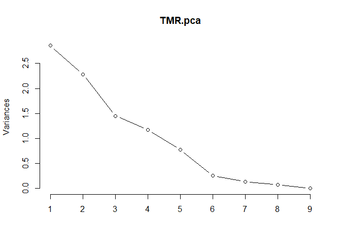<!-- -->

``` r
summary(TMR.pca)
```

    ## Importance of components:
    ##                           PC1    PC2    PC3    PC4     PC5     PC6     PC7
    ## Standard deviation     1.6894 1.5105 1.2042 1.0828 0.87930 0.50570 0.36960
    ## Proportion of Variance 0.3171 0.2535 0.1611 0.1303 0.08591 0.02842 0.01518
    ## Cumulative Proportion  0.3171 0.5706 0.7317 0.8620 0.94792 0.97634 0.99152
    ##                            PC8       PC9
    ## Standard deviation     0.27633 1.001e-09
    ## Proportion of Variance 0.00848 0.000e+00
    ## Cumulative Proportion  1.00000 1.000e+00

``` r
biplot(TMR.pca)
```

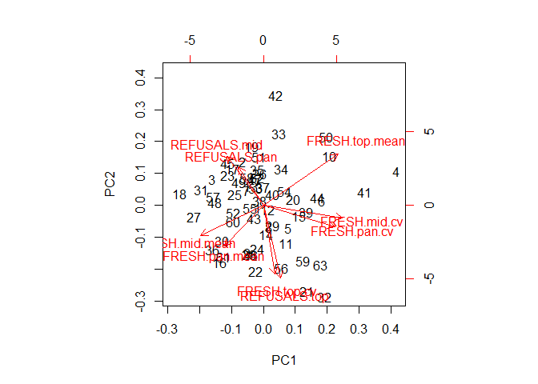<!-- -->

``` r
fviz_pca_var(TMR.pca, col.var = "black")
```

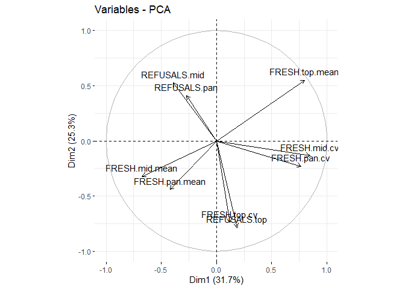<!-- -->

# Regression Tree TMR + SURVEY

## PC1

``` r
fit <- rpart(PREDICT_PCA$PC1 ~ SPOILAGE + SCRAPING + HOR_VERT_DRUM + AUGER + KNIVES + HAY_PROCESSING + POSITION + MIXING_START + MIXING_AFTER_LAST + LIQUID + FILLING + RPM_2 + MOVEMENT + EMPTY, data = DATASET1, method="anova")

printcp(fit) # display the results 
```

    ## 
    ## Regression tree:
    ## rpart(formula = PREDICT_PCA$PC1 ~ SPOILAGE + SCRAPING + HOR_VERT_DRUM + 
    ##     AUGER + KNIVES + HAY_PROCESSING + POSITION + MIXING_START + 
    ##     MIXING_AFTER_LAST + LIQUID + FILLING + RPM_2 + MOVEMENT + 
    ##     EMPTY, data = DATASET1, method = "anova")
    ## 
    ## Variables actually used in tree construction:
    ## [1] FILLING           MIXING_AFTER_LAST POSITION          RPM_2            
    ## 
    ## Root node error: 176.96/63 = 2.8088
    ## 
    ## n= 63 
    ## 
    ##         CP nsplit rel error xerror    xstd
    ## 1 0.062608      0   1.00000 1.0316 0.22902
    ## 2 0.015942      2   0.87478 1.2093 0.27569
    ## 3 0.010000      4   0.84290 1.2836 0.28327

``` r
plotcp(fit) # visualize cross-validation results 
```

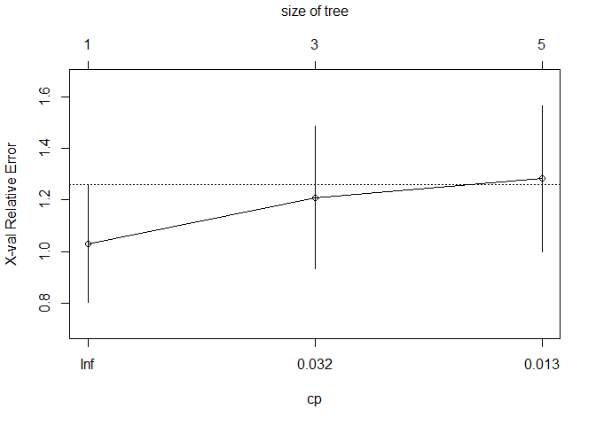<!-- -->

``` r
summary(fit) # detailed summary of splits
```

    ## Call:
    ## rpart(formula = PREDICT_PCA$PC1 ~ SPOILAGE + SCRAPING + HOR_VERT_DRUM + 
    ##     AUGER + KNIVES + HAY_PROCESSING + POSITION + MIXING_START + 
    ##     MIXING_AFTER_LAST + LIQUID + FILLING + RPM_2 + MOVEMENT + 
    ##     EMPTY, data = DATASET1, method = "anova")
    ##   n= 63 
    ## 
    ##           CP nsplit rel error   xerror      xstd
    ## 1 0.06260792      0 1.0000000 1.031569 0.2290194
    ## 2 0.01594223      2 0.8747842 1.209272 0.2756929
    ## 3 0.01000000      4 0.8428997 1.283607 0.2832719
    ## 
    ## Variable importance
    ##             RPM_2          POSITION MIXING_AFTER_LAST           FILLING 
    ##                33                31                 9                 7 
    ##            LIQUID      MIXING_START     HOR_VERT_DRUM          SCRAPING 
    ##                 7                 4                 3                 3 
    ##          MOVEMENT 
    ##                 2 
    ## 
    ## Node number 1: 63 observations,    complexity param=0.06260792
    ##   mean=-3.313046e-16, MSE=2.808815 
    ##   left son=2 (41 obs) right son=3 (22 obs)
    ##   Primary splits:
    ##       POSITION     splits as  RL,  improve=0.06113871, (0 missing)
    ##       LIQUID       splits as  LR,  improve=0.04841654, (0 missing)
    ##       SPOILAGE     splits as  LR,  improve=0.04625282, (1 missing)
    ##       MIXING_START splits as  LRL, improve=0.02505020, (0 missing)
    ##       RPM_2        splits as  RL,  improve=0.02424322, (1 missing)
    ## 
    ## Node number 2: 41 observations,    complexity param=0.01594223
    ##   mean=-0.3035562, MSE=2.415466 
    ##   left son=4 (29 obs) right son=5 (12 obs)
    ##   Primary splits:
    ##       FILLING           splits as  LRR, improve=0.024569920, (0 missing)
    ##       SPOILAGE          splits as  LR,  improve=0.018256510, (1 missing)
    ##       MIXING_AFTER_LAST splits as  LRL, improve=0.014128440, (0 missing)
    ##       EMPTY             splits as  RL,  improve=0.006696309, (2 missing)
    ##       AUGER             splits as  RL,  improve=0.002751910, (4 missing)
    ##   Surrogate splits:
    ##       MOVEMENT     splits as  RL,  agree=0.780, adj=0.250, (0 split)
    ##       MIXING_START splits as  LLR, agree=0.756, adj=0.167, (0 split)
    ## 
    ## Node number 3: 22 observations,    complexity param=0.06260792
    ##   mean=0.5657184, MSE=3.05011 
    ##   left son=6 (10 obs) right son=7 (12 obs)
    ##   Primary splits:
    ##       RPM_2             splits as  RL,  improve=0.16897740, (0 missing)
    ##       MIXING_AFTER_LAST splits as  LLR, improve=0.10593720, (1 missing)
    ##       SPOILAGE          splits as  LR,  improve=0.07804298, (0 missing)
    ##       HAY_PROCESSING    splits as  LR,  improve=0.01473881, (0 missing)
    ##       SCRAPING          splits as  LR,  improve=0.01226219, (0 missing)
    ##   Surrogate splits:
    ##       LIQUID        splits as  LR,  agree=0.636, adj=0.2, (0 split)
    ##       SCRAPING      splits as  RL,  agree=0.591, adj=0.1, (0 split)
    ##       HOR_VERT_DRUM splits as  LR,  agree=0.591, adj=0.1, (0 split)
    ##       MIXING_START  splits as  RRL, agree=0.591, adj=0.1, (0 split)
    ## 
    ## Node number 4: 29 observations,    complexity param=0.01594223
    ##   mean=-0.4602652, MSE=1.292449 
    ##   left son=8 (22 obs) right son=9 (7 obs)
    ##   Primary splits:
    ##       MIXING_AFTER_LAST splits as  LRL, improve=0.085613060, (0 missing)
    ##       KNIVES            splits as  LR,  improve=0.075439660, (2 missing)
    ##       HAY_PROCESSING    splits as  LR,  improve=0.062856580, (0 missing)
    ##       EMPTY             splits as  RL,  improve=0.055406940, (2 missing)
    ##       SCRAPING          splits as  LR,  improve=0.002719065, (1 missing)
    ## 
    ## Node number 5: 12 observations
    ##   mean=0.07515724, MSE=4.926652 
    ## 
    ## Node number 6: 10 observations
    ##   mean=-0.2207163, MSE=2.581329 
    ## 
    ## Node number 7: 12 observations
    ##   mean=1.221081, MSE=2.495861 
    ## 
    ## Node number 8: 22 observations
    ##   mean=-0.6479004, MSE=1.111587 
    ## 
    ## Node number 9: 7 observations
    ##   mean=0.1294455, MSE=1.402463

``` r
# plot tree 
fancyRpartPlot(fit)
```

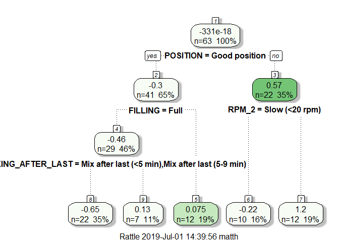<!-- -->

## PC2

``` r
fit <- rpart(PREDICT_PCA$PC2 ~ SPOILAGE + SCRAPING + HOR_VERT_DRUM + AUGER + KNIVES + HAY_PROCESSING + POSITION + MIXING_START + MIXING_AFTER_LAST + LIQUID + FILLING + RPM_2 + MOVEMENT + EMPTY, data = DATASET1, method="anova")

printcp(fit) # display the results 
```

    ## 
    ## Regression tree:
    ## rpart(formula = PREDICT_PCA$PC2 ~ SPOILAGE + SCRAPING + HOR_VERT_DRUM + 
    ##     AUGER + KNIVES + HAY_PROCESSING + POSITION + MIXING_START + 
    ##     MIXING_AFTER_LAST + LIQUID + FILLING + RPM_2 + MOVEMENT + 
    ##     EMPTY, data = DATASET1, method = "anova")
    ## 
    ## Variables actually used in tree construction:
    ## [1] HAY_PROCESSING    HOR_VERT_DRUM     MIXING_AFTER_LAST SPOILAGE         
    ## 
    ## Root node error: 141.45/63 = 2.2453
    ## 
    ## n= 63 
    ## 
    ##         CP nsplit rel error  xerror    xstd
    ## 1 0.203115      0   1.00000 1.02798 0.17788
    ## 2 0.065804      1   0.79688 0.84124 0.13910
    ## 3 0.045003      2   0.73108 0.88400 0.15584
    ## 4 0.012389      3   0.68608 0.89736 0.16649
    ## 5 0.010000      4   0.67369 0.92534 0.17208

``` r
plotcp(fit) # visualize cross-validation results 
```

<!-- -->

``` r
summary(fit) # detailed summary of splits
```

    ## Call:
    ## rpart(formula = PREDICT_PCA$PC2 ~ SPOILAGE + SCRAPING + HOR_VERT_DRUM + 
    ##     AUGER + KNIVES + HAY_PROCESSING + POSITION + MIXING_START + 
    ##     MIXING_AFTER_LAST + LIQUID + FILLING + RPM_2 + MOVEMENT + 
    ##     EMPTY, data = DATASET1, method = "anova")
    ##   n= 63 
    ## 
    ##           CP nsplit rel error    xerror      xstd
    ## 1 0.20311544      0 1.0000000 1.0279826 0.1778781
    ## 2 0.06580422      1 0.7968846 0.8412369 0.1390964
    ## 3 0.04500310      2 0.7310803 0.8840001 0.1558352
    ## 4 0.01238903      3 0.6860772 0.8973642 0.1664876
    ## 5 0.01000000      4 0.6736882 0.9253431 0.1720774
    ## 
    ## Variable importance
    ##          SPOILAGE          SCRAPING     HOR_VERT_DRUM MIXING_AFTER_LAST 
    ##                44                16                15                10 
    ##      MIXING_START          POSITION    HAY_PROCESSING            LIQUID 
    ##                 5                 5                 3                 2 
    ##           FILLING 
    ##                 1 
    ## 
    ## Node number 1: 63 observations,    complexity param=0.2031154
    ##   mean=1.198336e-16, MSE=2.24526 
    ##   left son=2 (28 obs) right son=3 (35 obs)
    ##   Primary splits:
    ##       SPOILAGE          splits as  RL,  improve=0.19723230, (1 missing)
    ##       MIXING_START      splits as  RLR, improve=0.06034323, (0 missing)
    ##       HOR_VERT_DRUM     splits as  LR,  improve=0.04486213, (0 missing)
    ##       MIXING_AFTER_LAST splits as  LLR, improve=0.03026146, (1 missing)
    ##       HAY_PROCESSING    splits as  RL,  improve=0.02905329, (0 missing)
    ##   Surrogate splits:
    ##       SCRAPING     splits as  LR,  agree=0.710, adj=0.357, (0 split)
    ##       POSITION     splits as  LR,  agree=0.581, adj=0.071, (1 split)
    ##       MIXING_START splits as  RLR, agree=0.565, adj=0.036, (0 split)
    ##       LIQUID       splits as  LR,  agree=0.565, adj=0.036, (0 split)
    ## 
    ## Node number 2: 28 observations,    complexity param=0.0450031
    ##   mean=-0.7550224, MSE=1.744285 
    ##   left son=4 (16 obs) right son=5 (12 obs)
    ##   Primary splits:
    ##       MIXING_AFTER_LAST splits as  LLR, improve=0.130339000, (0 missing)
    ##       MOVEMENT          splits as  LR,  improve=0.052445770, (0 missing)
    ##       HAY_PROCESSING    splits as  RL,  improve=0.010036770, (0 missing)
    ##       SCRAPING          splits as  RL,  improve=0.009279592, (0 missing)
    ##       EMPTY             splits as  LR,  improve=0.007821934, (1 missing)
    ##   Surrogate splits:
    ##       MIXING_START splits as  LLR, agree=0.714, adj=0.333, (0 split)
    ##       POSITION     splits as  RL,  agree=0.643, adj=0.167, (0 split)
    ##       FILLING      splits as  LLR, agree=0.607, adj=0.083, (0 split)
    ## 
    ## Node number 3: 35 observations,    complexity param=0.06580422
    ##   mean=0.6040179, MSE=1.825156 
    ##   left son=6 (8 obs) right son=7 (27 obs)
    ##   Primary splits:
    ##       HOR_VERT_DRUM splits as  LR, improve=0.14571120, (0 missing)
    ##       POSITION      splits as  RL, improve=0.07920059, (0 missing)
    ##       AUGER         splits as  RL, improve=0.07115454, (3 missing)
    ##       SCRAPING      splits as  RL, improve=0.04638436, (1 missing)
    ##       RPM_2         splits as  RL, improve=0.04125286, (1 missing)
    ## 
    ## Node number 4: 16 observations
    ##   mean=-1.167952, MSE=1.630597 
    ## 
    ## Node number 5: 12 observations
    ##   mean=-0.204449, MSE=1.365389 
    ## 
    ## Node number 6: 8 observations
    ##   mean=-0.3433821, MSE=2.537509 
    ## 
    ## Node number 7: 27 observations,    complexity param=0.01238903
    ##   mean=0.884729, MSE=1.269344 
    ##   left son=14 (15 obs) right son=15 (12 obs)
    ##   Primary splits:
    ##       HAY_PROCESSING splits as  RL,  improve=0.05113304, (0 missing)
    ##       POSITION       splits as  RL,  improve=0.04758470, (0 missing)
    ##       MOVEMENT       splits as  LR,  improve=0.03396459, (0 missing)
    ##       SCRAPING       splits as  RL,  improve=0.03106525, (1 missing)
    ##       FILLING        splits as  RLL, improve=0.01460682, (0 missing)
    ##   Surrogate splits:
    ##       SCRAPING          splits as  RL,  agree=0.630, adj=0.167, (0 split)
    ##       MIXING_AFTER_LAST splits as  LLR, agree=0.593, adj=0.083, (0 split)
    ##       FILLING           splits as  LRL, agree=0.593, adj=0.083, (0 split)
    ## 
    ## Node number 14: 15 observations
    ##   mean=0.6568599, MSE=0.9604078 
    ## 
    ## Node number 15: 12 observations
    ##   mean=1.169565, MSE=1.509477

``` r
# plot tree 
fancyRpartPlot(fit)
```

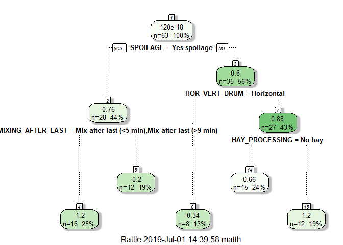<!-- -->

# Factor Analysis of Mixed Data TMR + SURVEY

``` r
datafamd <- na.omit(DATASET1[,c(2:10,        ## TMRaudit active
                                   13,16,22,23,26,  ## active categorical variables
                                   15,19,21,24,27,28,30,32,33         ## supplementary categorical variables 
                                   )])

datafamd$FRESH.top.mean <- scale((datafamd$FRESH.top.mean), center = TRUE, scale = TRUE)
datafamd$FRESH.mid.mean <- scale((datafamd$FRESH.mid.mean), center = TRUE, scale = TRUE)
datafamd$FRESH.pan.mean <- scale((datafamd$FRESH.pan.mean), center = TRUE, scale = TRUE)
datafamd$FRESH.top.cv <- scale((datafamd$FRESH.top.cv), center = TRUE, scale = TRUE)
datafamd$FRESH.mid.cv <- scale((datafamd$FRESH.mid.cv), center = TRUE, scale = TRUE)
datafamd$FRESH.pan.cv <- scale((datafamd$FRESH.pan.cv), center = TRUE, scale = TRUE)
datafamd$REFUSALS.top <- scale((datafamd$REFUSALS.top), center = TRUE, scale = TRUE)
datafamd$REFUSALS.mid <- scale((datafamd$REFUSALS.mid), center = TRUE, scale = TRUE)
datafamd$REFUSALS.pan <- scale((datafamd$REFUSALS.pan), center = TRUE, scale = TRUE)

summary(datafamd)
```

    ##   FRESH.mid.mean.V1    FRESH.pan.mean.V1    FRESH.top.mean.V1  
    ##  Min.   :-2.5980999   Min.   :-1.5582386   Min.   :-1.8578091  
    ##  1st Qu.:-0.9834333   1st Qu.:-0.7336327   1st Qu.:-0.4798073  
    ##  Median : 0.1586527   Median : 0.0086126   Median :-0.1406580  
    ##  Mean   : 0.0000000   Mean   : 0.0000000   Mean   : 0.0000000  
    ##  3rd Qu.: 0.6295261   3rd Qu.: 0.6092112   3rd Qu.: 0.4655080  
    ##  Max.   : 1.8706141   Max.   : 2.0408219   Max.   : 2.9473553  
    ##    FRESH.mid.cv.V1      FRESH.pan.cv.V1      FRESH.top.cv.V1   
    ##  Min.   :-2.1892416   Min.   :-1.7634903   Min.   :-2.5084628  
    ##  1st Qu.:-0.6410230   1st Qu.:-0.6552397   1st Qu.:-0.5781321  
    ##  Median : 0.0289515   Median :-0.2240323   Median :-0.1511531  
    ##  Mean   : 0.0000000   Mean   : 0.0000000   Mean   : 0.0000000  
    ##  3rd Qu.: 0.5505385   3rd Qu.: 0.3230163   3rd Qu.: 0.4655137  
    ##  Max.   : 2.4120249   Max.   : 2.8296061   Max.   : 2.5579657  
    ##    REFUSALS.mid.V1     REFUSALS.pan.V1      REFUSALS.top.V1   
    ##  Min.   :-3.194632   Min.   :-2.4773000   Min.   :-1.8009533  
    ##  1st Qu.:-0.458329   1st Qu.:-0.3862120   1st Qu.:-0.7697309  
    ##  Median : 0.130968   Median : 0.0032068   Median :-0.1317794  
    ##  Mean   : 0.000000   Mean   : 0.0000000   Mean   : 0.0000000  
    ##  3rd Qu.: 0.675260   3rd Qu.: 0.6512748   3rd Qu.: 0.6463161  
    ##  Max.   : 2.334802   Max.   : 1.9557822   Max.   : 2.1941079  
    ##          SPOILAGE     HOR_VERT_DRUM HAY_PROCESSING          POSITION 
    ##  No spoilage :27   Horizontal: 5    Hay   :23      Bad position :16  
    ##  Yes spoilage:23   Vertical  :45    No hay:27      Good position:34  
    ##                                                                      
    ##                                                                      
    ##                                                                      
    ##                                                                      
    ##                 MIXING_AFTER_LAST               SCRAPING         AUGER   
    ##  Mix after last (<5 min) :19      Not scraped       :25   Auger new :37  
    ##  Mix after last (>9 min) :11      Scraped vertically:25   Auger worn:13  
    ##  Mix after last (5-9 min):20                                             
    ##                                                                          
    ##                                                                          
    ##                                                                          
    ##          KNIVES        MIXING_START       LIQUID          FILLING  
    ##  Knive sharp:25   Begin mix  :36    Liquid   : 9   Full       :37  
    ##  Knive worn :25   End mix    : 5    No liquid:41   Overfilled :11  
    ##                   Halfway mix: 9                   Underfilled: 2  
    ##                                                                    
    ##                                                                    
    ##                                                                    
    ##             RPM_2               MOVEMENT            EMPTY   
    ##  Fast (>20 rpm):34   Little movement:15   Empty mixer  :33  
    ##  Slow (<20 rpm):16   Movement       :35   Remnant mixer:17  
    ##                                                             
    ##                                                             
    ##                                                             
    ## 

``` r
res.mfa <- FAMD(datafamd, graph=TRUE, sup.var=c(15:23))
```

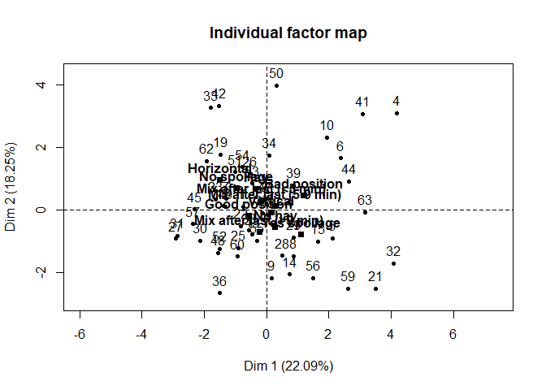<!-- -->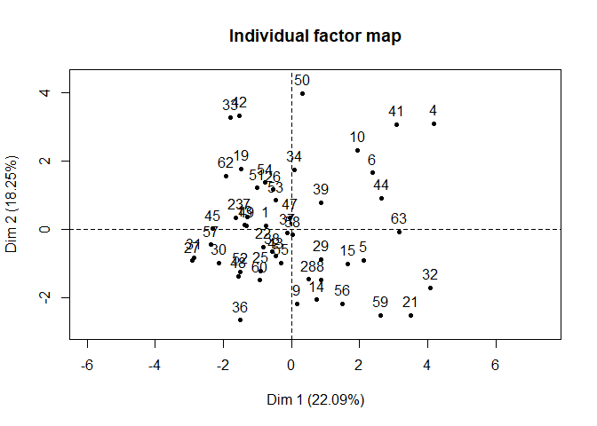<!-- -->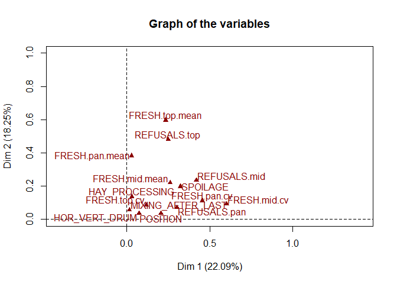<!-- -->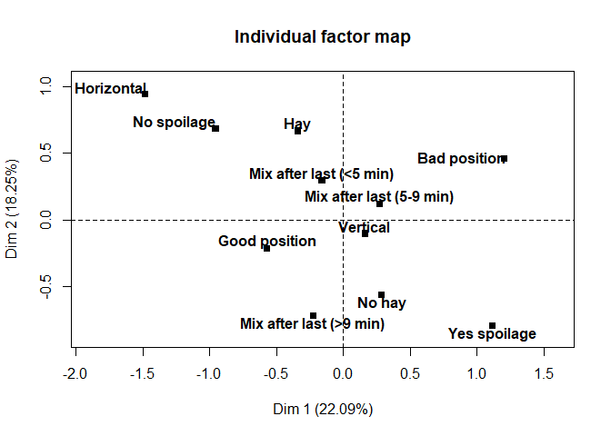<!-- -->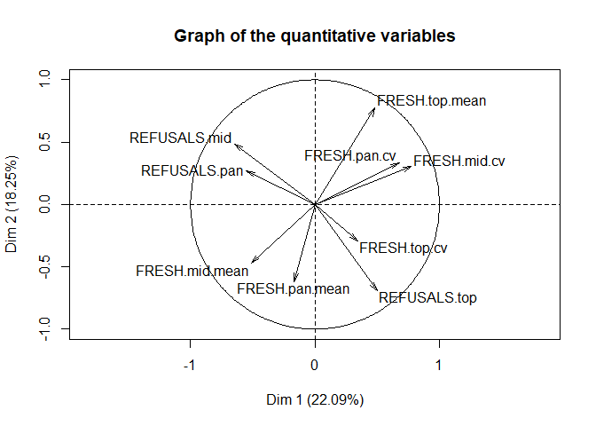<!-- -->

``` r
print(res.mfa)
```

    ## *The results are available in the following objects:
    ## 
    ##   name          description                             
    ## 1 "$eig"        "eigenvalues and inertia"               
    ## 2 "$var"        "Results for the variables"             
    ## 3 "$ind"        "results for the individuals"           
    ## 4 "$quali.var"  "Results for the qualitative variables" 
    ## 5 "$quanti.var" "Results for the quantitative variables"

``` r
eig.val <- get_eigenvalue(res.mfa)
head(eig.val)
```

    ##       eigenvalue variance.percent cumulative.variance.percent
    ## Dim.1   3.313406        22.089372                    22.08937
    ## Dim.2   2.737714        18.251424                    40.34080
    ## Dim.3   2.097188        13.981250                    54.32205
    ## Dim.4   1.308376         8.722503                    63.04455
    ## Dim.5   1.155183         7.701223                    70.74577

## visualisations

``` r
fviz_screeplot(res.mfa)
```

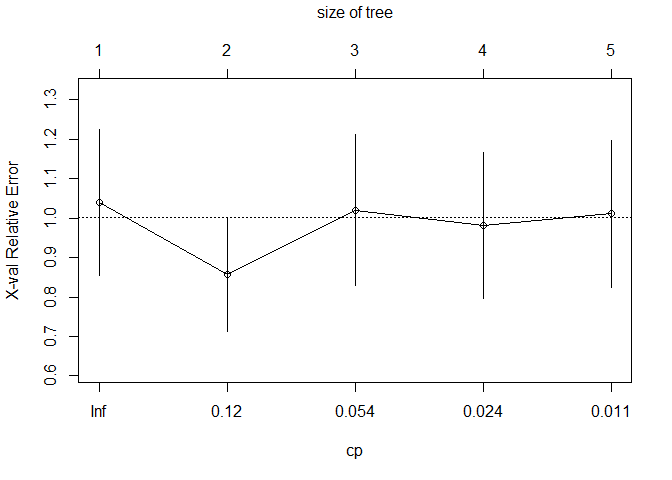<!-- -->

``` r
# Contribution to the first dimension
fviz_contrib(res.mfa, "var", 
             axes = 1)
```

<!-- -->

``` r
# Contribution to the second dimension
fviz_contrib(res.mfa, "var", 
             axes = 2)
```

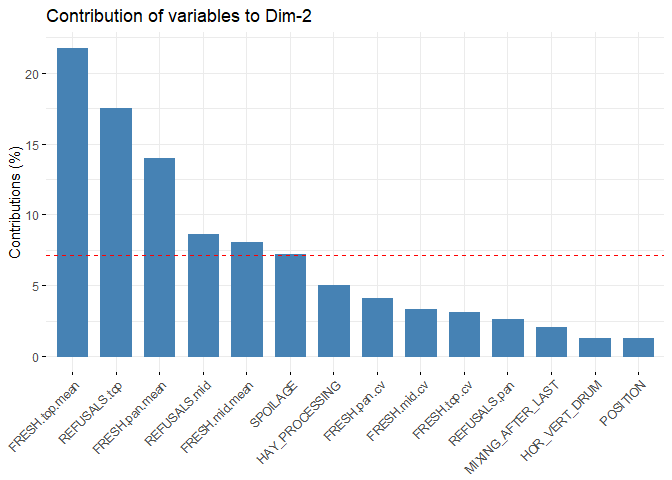<!-- -->

``` r
quanti.var <- get_famd_var(res.mfa, "quanti.var")
quanti.var 
```

    ## FAMD results for quantitative variables 
    ##  ===================================================
    ##   Name       Description                      
    ## 1 "$coord"   "Coordinates"                    
    ## 2 "$cos2"    "Cos2, quality of representation"
    ## 3 "$contrib" "Contributions"

``` r
fviz_famd_var(res.mfa, "quanti.var", col.var = "contrib", 
             gradient.cols = c("#00AFBB", "#E7B800", "#FC4E07"),
             repel = TRUE)
```

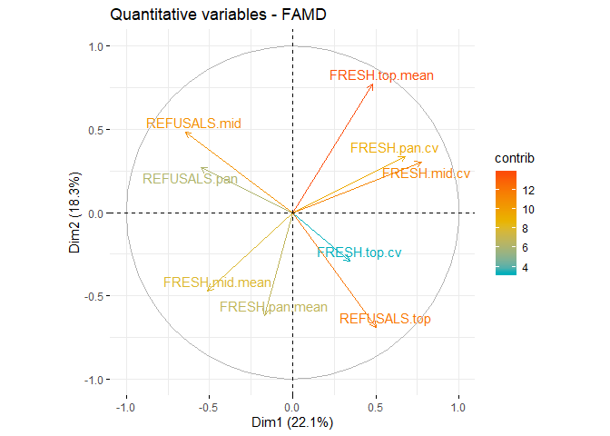<!-- -->

``` r
p <- fviz_famd_var(res.mfa, "quanti.var", label="none", col.var = "black")
p
```

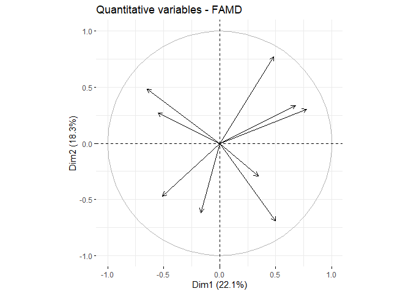<!-- -->

``` r
p + annotate("text", x=.7, y=1.1, label=expression("FRESH"[TOP.MEAN]), size=3, angle=60) +
  annotate("text", x=1, y=.5, label=expression("FRESH"[PAN.CV]), size=3, angle=30) +
  annotate("text", x=1.1, y=.45, label=expression("FRESH"[MID.CV]), size=3, angle=25) +
  annotate("text", x=.65, y=-.45, label=expression("FRESH"[TOP.CV]), size=3, angle=330) +
  annotate("text", x=.75, y=-1, label=expression("REFUSALS"[TOP]), size=3, angle=310) +
  annotate("text", x=-.3, y=-1, label=expression("FRESH"[PAN.MEAN]), size=3, angle=76) +
  annotate("text", x=-0.8, y=-.65, label=expression("FRESH"[MID.MEAN]), size=3, angle=40) +
  annotate("text", x=-.9, y=0.40, label=expression("REFUSALS"[PAN]), size=3, angle=340) +
  annotate("text", x=-.95, y=0.7, label=expression("REFUSALS"[MID]), size=3, angle=330) +
  expand_limits(x=c(-1.5,1.5), y=c(-1.5,1.5))
```

    ## Warning in is.na(x): is.na() applied to non-(list or vector) of type
    ## 'expression'
    
    ## Warning in is.na(x): is.na() applied to non-(list or vector) of type
    ## 'expression'
    
    ## Warning in is.na(x): is.na() applied to non-(list or vector) of type
    ## 'expression'
    
    ## Warning in is.na(x): is.na() applied to non-(list or vector) of type
    ## 'expression'
    
    ## Warning in is.na(x): is.na() applied to non-(list or vector) of type
    ## 'expression'
    
    ## Warning in is.na(x): is.na() applied to non-(list or vector) of type
    ## 'expression'
    
    ## Warning in is.na(x): is.na() applied to non-(list or vector) of type
    ## 'expression'
    
    ## Warning in is.na(x): is.na() applied to non-(list or vector) of type
    ## 'expression'
    
    ## Warning in is.na(x): is.na() applied to non-(list or vector) of type
    ## 'expression'

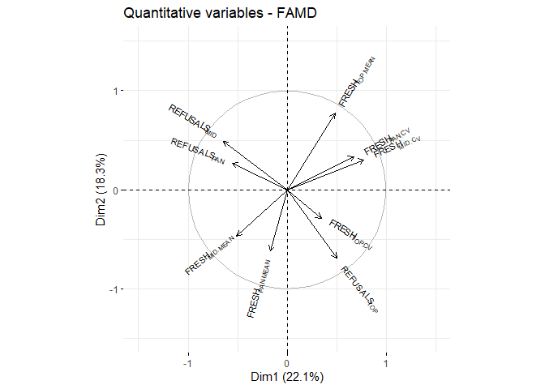<!-- -->

``` r
quali.var <- get_famd_var(res.mfa, "quali.var")
quali.var 
```

    ## FAMD results for qualitative variable categories 
    ##  ===================================================
    ##   Name       Description                      
    ## 1 "$coord"   "Coordinates"                    
    ## 2 "$cos2"    "Cos2, quality of representation"
    ## 3 "$contrib" "Contributions"

``` r
plot(res.mfa, choix = "quali")
```

<!-- -->

``` r
fviz_famd_var(res.mfa, "quali.var", repel = TRUE, col.var = "black")
```

<!-- -->

``` r
fviz_famd_ind(res.mfa, col.ind = "cos2", geom=c("point", "text"),
             gradient.cols = c("#00AFBB", "#E7B800", "#FC4E07"),
             repel = TRUE, invisible = "quali.var")
```

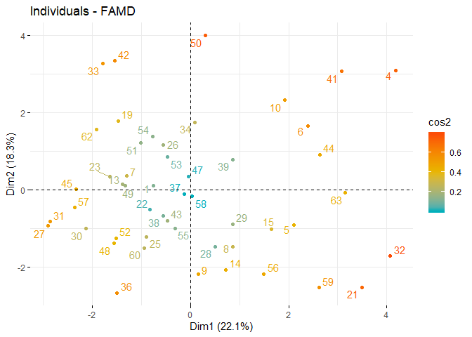<!-- -->

``` r
fviz_ellipses(res.mfa, c("POSITION", "SPOILAGE", "HOR_VERT_DRUM", "HAY_PROCESSING", "MIXING_AFTER_LAST"), repel = TRUE)
```

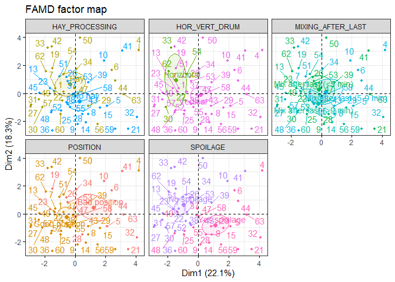<!-- -->

# MPR + ENQ

## Making a new matrix with MPR and SELECTED SURVEY VARIABLES

``` r
MPR <- read.csv2("MPR_data.csv")
summary(MPR)
```

    ##       HERD         COWS             DIM            KGMILK     
    ##  Herd 1 : 1   Min.   : 47.00   Min.   :126.0   Min.   :24.80  
    ##  Herd 10: 1   1st Qu.: 83.25   1st Qu.:164.2   1st Qu.:29.20  
    ##  Herd 11: 1   Median :126.50   Median :173.5   Median :30.85  
    ##  Herd 12: 1   Mean   :154.63   Mean   :175.8   Mean   :30.90  
    ##  Herd 14: 1   3rd Qu.:189.00   3rd Qu.:189.8   3rd Qu.:32.27  
    ##  Herd 15: 1   Max.   :536.00   Max.   :235.0   Max.   :40.10  
    ##  (Other):48                                                   
    ##       FPCM            FAT           PROTEIN           KGFP      
    ##  Min.   :25.37   Min.   :37.70   Min.   :32.90   Min.   :1.600  
    ##  1st Qu.:30.46   1st Qu.:41.25   1st Qu.:34.52   1st Qu.:2.300  
    ##  Median :32.30   Median :42.40   Median :35.35   Median :2.400  
    ##  Mean   :32.28   Mean   :42.86   Mean   :35.35   Mean   :2.404  
    ##  3rd Qu.:33.77   3rd Qu.:44.50   3rd Qu.:36.08   3rd Qu.:2.500  
    ##  Max.   :40.35   Max.   :54.10   Max.   :39.00   Max.   :3.000  
    ##                                                                 
    ##       AGE           AGE_YEAR    
    ##  Min.   :3.010   Min.   :3.083  
    ##  1st Qu.:3.050   1st Qu.:3.417  
    ##  Median :3.065   Median :3.542  
    ##  Mean   :3.207   Mean   :3.595  
    ##  3rd Qu.:3.090   3rd Qu.:3.750  
    ##  Max.   :4.050   Max.   :4.417  
    ##  NA's   :2       NA's   :2

``` r
sd(MPR$COWS)
```

    ## [1] 105.9586

``` r
sd(MPR$DIM)
```

    ## [1] 22.50205

``` r
sd(MPR$KGMILK)
```

    ## [1] 3.070584

``` r
sd(MPR$FPCM)
```

    ## [1] 2.806805

``` r
sd(MPR$FAT)
```

    ## [1] 2.894573

``` r
sd(MPR$PROTEIN)
```

    ## [1] 1.144097

``` r
sd(MPR$KGFP)
```

    ## [1] 0.2206021

``` r
sd(na.omit(MPR$AGE_YEAR))
```

    ## [1] 0.290568

``` r
par(mfrow = c(3,3))
hist(MPR$DIM)
hist(MPR$KGMILK)
hist(MPR$FPCM)
hist(MPR$FAT)
hist(MPR$PROTEIN)
hist(MPR$KGFP)
hist(MPR$AGE_YEAR)
```

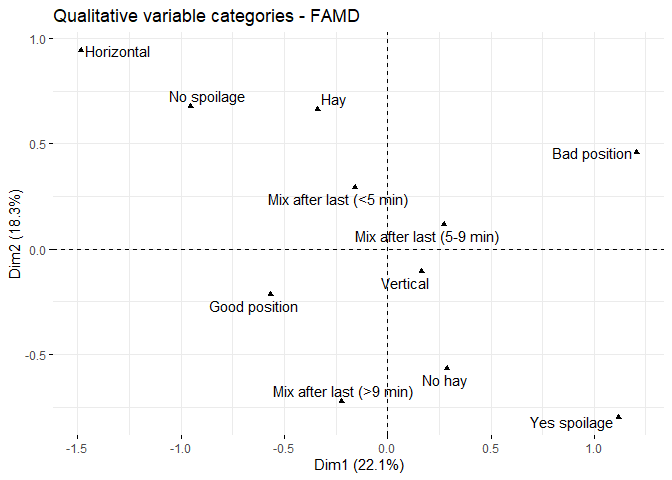<!-- -->

``` r
par(mfrow = c(3,3))
shapiro.test(MPR$DIM)
```

    ## 
    ##  Shapiro-Wilk normality test
    ## 
    ## data:  MPR$DIM
    ## W = 0.98634, p-value = 0.7934

``` r
qqnorm(MPR$DIM); qqline(MPR$DIM)
shapiro.test(MPR$KGMILK)
```

    ## 
    ##  Shapiro-Wilk normality test
    ## 
    ## data:  MPR$KGMILK
    ## W = 0.96285, p-value = 0.09244

``` r
qqnorm(MPR$KGMILK); qqline(MPR$KGMILK)
shapiro.test(MPR$FPCM)
```

    ## 
    ##  Shapiro-Wilk normality test
    ## 
    ## data:  MPR$FPCM
    ## W = 0.96949, p-value = 0.1831

``` r
qqnorm(MPR$FPCM); qqline(MPR$FPCM)
shapiro.test(MPR$FAT)
```

    ## 
    ##  Shapiro-Wilk normality test
    ## 
    ## data:  MPR$FAT
    ## W = 0.91816, p-value = 0.001273

``` r
qqnorm(MPR$FAT); qqline(MPR$FAT)
shapiro.test(MPR$PROTEIN)
```

    ## 
    ##  Shapiro-Wilk normality test
    ## 
    ## data:  MPR$PROTEIN
    ## W = 0.97826, p-value = 0.4293

``` r
qqnorm(MPR$PROTEIN); qqline(MPR$PROTEIN)
shapiro.test(MPR$KGFP)
```

    ## 
    ##  Shapiro-Wilk normality test
    ## 
    ## data:  MPR$KGFP
    ## W = 0.93177, p-value = 0.004293

``` r
qqnorm(MPR$KGFP); qqline(MPR$KGFP)
shapiro.test(MPR$AGE_YEAR)
```

    ## 
    ##  Shapiro-Wilk normality test
    ## 
    ## data:  MPR$AGE_YEAR
    ## W = 0.9672, p-value = 0.1604

``` r
qqnorm(MPR$AGE_YEAR); qqline(MPR$AGE_YEAR)
```

<!-- -->

``` r
DATASET2 <- merge(MPR, DATASET1, by.x= 'HERD', by.y= "Herd", all = FALSE)
summary(DATASET2)
```

    ##       HERD         COWS            DIM            KGMILK     
    ##  Herd 1 : 1   Min.   : 47.0   Min.   :126.0   Min.   :24.80  
    ##  Herd 10: 1   1st Qu.: 83.5   1st Qu.:164.0   1st Qu.:29.30  
    ##  Herd 11: 1   Median :123.0   Median :173.0   Median :31.00  
    ##  Herd 12: 1   Mean   :147.3   Mean   :175.0   Mean   :31.05  
    ##  Herd 14: 1   3rd Qu.:184.0   3rd Qu.:188.5   3rd Qu.:32.25  
    ##  Herd 15: 1   Max.   :536.0   Max.   :235.0   Max.   :40.10  
    ##  (Other):45                                                  
    ##       FPCM            FAT           PROTEIN           KGFP      
    ##  Min.   :25.37   Min.   :37.70   Min.   :32.90   Min.   :1.600  
    ##  1st Qu.:30.55   1st Qu.:41.30   1st Qu.:34.45   1st Qu.:2.300  
    ##  Median :32.34   Median :42.40   Median :35.30   Median :2.400  
    ##  Mean   :32.37   Mean   :42.67   Mean   :35.28   Mean   :2.408  
    ##  3rd Qu.:33.92   3rd Qu.:44.35   3rd Qu.:35.90   3rd Qu.:2.500  
    ##  Max.   :40.35   Max.   :50.40   Max.   :37.70   Max.   :3.000  
    ##                                                                 
    ##       AGE           AGE_YEAR     FRESH.mid.mean   FRESH.pan.mean  
    ##  Min.   :3.010   Min.   :3.083   Min.   :0.1571   Min.   :0.2523  
    ##  1st Qu.:3.050   1st Qu.:3.417   1st Qu.:0.3088   1st Qu.:0.3364  
    ##  Median :3.070   Median :3.583   Median :0.3910   Median :0.3968  
    ##  Mean   :3.217   Mean   :3.609   Mean   :0.3812   Mean   :0.3949  
    ##  3rd Qu.:3.090   3rd Qu.:3.750   3rd Qu.:0.4370   3rd Qu.:0.4616  
    ##  Max.   :4.050   Max.   :4.417   Max.   :0.5444   Max.   :0.5586  
    ##  NA's   :2       NA's   :2                                        
    ##  FRESH.top.mean     FRESH.mid.cv     FRESH.pan.cv    FRESH.top.cv  
    ##  Min.   :0.01517   Min.   :0.8072   Min.   :1.083   Min.   :1.761  
    ##  1st Qu.:0.14807   1st Qu.:1.8130   1st Qu.:1.670   1st Qu.:2.880  
    ##  Median :0.21734   Median :2.2893   Median :1.942   Median :3.114  
    ##  Mean   :0.22386   Mean   :2.2114   Mean   :2.036   Mean   :3.219  
    ##  3rd Qu.:0.27465   3rd Qu.:2.6009   3rd Qu.:2.133   3rd Qu.:3.556  
    ##  Max.   :0.59068   Max.   :3.8025   Max.   :3.657   Max.   :4.554  
    ##                                                                    
    ##   REFUSALS.mid         REFUSALS.pan      REFUSALS.top     
    ##  Min.   :-0.3719836   Min.   :-0.8495   Min.   :-0.45543  
    ##  1st Qu.:-0.1111710   1st Qu.:-0.2301   1st Qu.: 0.03289  
    ##  Median : 0.0008292   Median :-0.1727   Median : 0.25692  
    ##  Mean   :-0.0049886   Mean   :-0.1845   Mean   : 0.26195  
    ##  3rd Qu.: 0.0988444   3rd Qu.:-0.0979   3rd Qu.: 0.46390  
    ##  Max.   : 0.4276215   Max.   : 0.1382   Max.   : 0.90425  
    ##                                                           
    ##  CONSERVATION_SCORE            CONSERVATION         SPOILAGE 
    ##  1   : 1            Bad conservation :11    No spoilage :27  
    ##  2   : 3            Good conservation:39    Yes spoilage:23  
    ##  3   : 7            NA's             : 1    NA's        : 1  
    ##  4   :32                                                     
    ##  5   : 7                                                     
    ##  NA's: 1                                                     
    ##                                                              
    ##  SCRAPING_SCORE               SCRAPING     HOR_VERT_DRUM      SIZE      
    ##  1   : 2        Not scraped       :26   Horizontal:11    Min.   :10.00  
    ##  2   :13        Scraped vertically:24   Vertical  :40    1st Qu.:14.00  
    ##  3   :11        NA's              : 1                    Median :16.00  
    ##  4   :16                                                 Mean   :17.26  
    ##  5   : 8                                                 3rd Qu.:20.00  
    ##  NA's: 1                                                 Max.   :30.00  
    ##                                                          NA's   :1      
    ##  AUGER_SCORE        AUGER    KNIVES_SCORE         KNIVES   HAY_PROCESSING
    ##  2   : 8     Auger new :28   1   : 6      Knive sharp:21   Hay   :21     
    ##  3   : 9     Auger worn:17   2   : 5      Knive worn :24   No hay:30     
    ##  4   :18     NA's      : 6   3   :13      NA's       : 6                 
    ##  5   :10                     4   :12                                     
    ##  NA's: 6                     5   : 9                                     
    ##                              NA's: 6                                     
    ##                                                                          
    ##           POSITION       MIXING_START MIXING_AFTER_LAST_MIN
    ##  Bad position :17   Begin mix  :35    7      : 8           
    ##  Good position:34   End mix    : 7    5      : 6           
    ##                     Halfway mix: 9    1      : 4           
    ##                                       3      : 4           
    ##                                       4      : 4           
    ##                                       (Other):24           
    ##                                       NA's   : 1           
    ##                 MIXING_AFTER_LAST       LIQUID          FILLING  
    ##  Mix after last (<5 min) :17      Liquid   : 7   Full       :37  
    ##  Mix after last (>9 min) :10      No liquid:44   Overfilled :12  
    ##  Mix after last (5-9 min):23                     Underfilled: 2  
    ##  NA's                    : 1                                     
    ##                                                                  
    ##                                                                  
    ##                                                                  
    ##               RPM                RPM_2    MOVEMENT_SCORE
    ##  Fast (20-30)   :26   Fast (>20 rpm):30   2: 4          
    ##  Slow (10-19)   :17   Slow (<20 rpm):20   3:11          
    ##  Very fast (>30): 4   NA's          : 1   4:32          
    ##  Very slow (<10): 3                       5: 4          
    ##  NA's           : 1                                     
    ##                                                         
    ##                                                         
    ##             MOVEMENT            EMPTY   
    ##  Little movement:15   Empty mixer  :34  
    ##  Movement       :36   Remnant mixer:15  
    ##                       NA's         : 2  
    ##                                         
    ##                                         
    ##                                         
    ## 

``` r
sd(DATASET2$COWS)
```

    ## [1] 93.34342

``` r
sd(DATASET2$DIM)
```

    ## [1] 22.7306

``` r
sd(DATASET2$KGMILK)
```

    ## [1] 3.000887

``` r
sd(DATASET2$FPCM)
```

    ## [1] 2.806381

``` r
sd(DATASET2$FAT)
```

    ## [1] 2.451992

``` r
sd(DATASET2$PROTEIN)
```

    ## [1] 1.042226

``` r
sd(DATASET2$KGFP)
```

    ## [1] 0.2225697

``` r
sd(na.omit(DATASET2$AGE_YEAR))
```

    ## [1] 0.2932505

``` r
DATASET2.pca <- prcomp(na.omit(DATASET2[,c(2:8,10,11:19)]),
                 center = TRUE,
                 scale. = TRUE) 
print(DATASET2.pca)
```

    ## Standard deviations (1, .., p=17):
    ##  [1] 1.905473e+00 1.663731e+00 1.574398e+00 1.423346e+00 1.192109e+00
    ##  [6] 9.917348e-01 9.343735e-01 9.282026e-01 8.176796e-01 7.250504e-01
    ## [11] 5.616012e-01 5.280598e-01 3.050471e-01 2.471871e-01 1.197673e-01
    ## [16] 1.461375e-02 1.002187e-09
    ## 
    ## Rotation (n x k) = (17 x 17):
    ##                        PC1          PC2         PC3         PC4
    ## COWS            0.06066605  0.279428093  0.26998333  0.24805505
    ## DIM             0.17681248  0.113830893  0.01927807 -0.19847863
    ## KGMILK         -0.49713387 -0.007468185 -0.09277683  0.07213851
    ## FPCM           -0.49307279 -0.083227192 -0.05846304 -0.08067383
    ## FAT             0.13840968 -0.241007701  0.08714745 -0.40829613
    ## PROTEIN         0.23316857  0.052896385  0.20527954 -0.30793234
    ## KGFP           -0.48205179 -0.070383334 -0.04889994 -0.13462277
    ## AGE_YEAR       -0.15192943 -0.269475280 -0.10633759  0.17604983
    ## FRESH.mid.mean -0.20708952  0.173078570  0.28662644 -0.33332956
    ## FRESH.pan.mean -0.03225959  0.355280422  0.15007231  0.28831989
    ## FRESH.top.mean  0.19428480 -0.414473728 -0.34985180  0.05146520
    ## FRESH.mid.cv    0.17802890  0.147580650 -0.47061685  0.13111539
    ## FRESH.pan.cv    0.09664469  0.239639965 -0.38703404 -0.12461816
    ## FRESH.top.cv   -0.02586286  0.506631423 -0.09303918 -0.14114739
    ## REFUSALS.mid    0.06021433 -0.216131468  0.35936276 -0.13817800
    ## REFUSALS.pan   -0.02428210  0.004155577  0.17565705  0.46363137
    ## REFUSALS.top   -0.13498413  0.230097302 -0.29030517 -0.30519085
    ##                        PC5          PC6          PC7         PC8
    ## COWS            0.08140368 -0.107420392  0.290953735 -0.02667174
    ## DIM            -0.25775955 -0.686552080  0.054193387  0.22779439
    ## KGMILK         -0.06987035 -0.121857159  0.102503711  0.19768046
    ## FPCM            0.03967779 -0.143554220 -0.035352962  0.19628481
    ## FAT             0.32073680  0.030041430 -0.381097973 -0.10032845
    ## PROTEIN         0.14143719 -0.334514504 -0.311456773  0.18234682
    ## KGFP            0.04892607 -0.161728571 -0.093495036  0.19199858
    ## AGE_YEAR        0.41623744  0.009999006 -0.291142225 -0.05887681
    ## FRESH.mid.mean  0.28689524 -0.016355708  0.322940291 -0.32344450
    ## FRESH.pan.mean -0.21548999  0.142672932 -0.553221836  0.25409490
    ## FRESH.top.mean -0.06937789 -0.096162131  0.160441736  0.06965308
    ## FRESH.mid.cv    0.23078196  0.011276263 -0.003988469  0.16193910
    ## FRESH.pan.cv    0.33795856 -0.010432200  0.155777400  0.27269785
    ## FRESH.top.cv    0.30223432  0.168919141  0.016175078  0.15150428
    ## REFUSALS.mid    0.01982244  0.391285312  0.125274628  0.57181433
    ## REFUSALS.pan    0.36067840 -0.344889416 -0.142115415 -0.16845963
    ## REFUSALS.top   -0.31478801  0.109081491 -0.261505275 -0.36499676
    ##                        PC9        PC10        PC11         PC12
    ## COWS           -0.65896228 -0.18379163  0.43121624  0.062107108
    ## DIM             0.26315514 -0.44284255  0.04607183  0.226053757
    ## KGMILK         -0.04486059  0.06447547 -0.02870944  0.002742564
    ## FPCM           -0.07055725  0.11974625  0.12536620  0.061051639
    ## FAT             0.04033881  0.05315903  0.60140909  0.211414156
    ## PROTEIN        -0.42705174  0.31089252 -0.42841193 -0.226578045
    ## KGFP           -0.11043982  0.13057178  0.12345229  0.039434702
    ## AGE_YEAR       -0.19811406 -0.68657725 -0.28959858 -0.008938901
    ## FRESH.mid.mean  0.15161067 -0.05856808 -0.16799592  0.107497214
    ## FRESH.pan.mean  0.07155856 -0.05282528  0.12572889 -0.033865934
    ## FRESH.top.mean -0.17904759  0.08850275  0.04097434 -0.061988908
    ## FRESH.mid.cv   -0.06004489  0.16897826 -0.08749495  0.629356174
    ## FRESH.pan.cv    0.15408931 -0.11904837  0.25995153 -0.623273971
    ## FRESH.top.cv    0.02645172  0.01266247 -0.15834187  0.160915688
    ## REFUSALS.mid    0.12182296 -0.17684292 -0.04430135  0.088848622
    ## REFUSALS.pan    0.37502388  0.19922560  0.05070135 -0.076213948
    ## REFUSALS.top   -0.10190165 -0.18919114  0.02251020 -0.054200654
    ##                        PC13          PC14          PC15          PC16
    ## COWS           -0.149358275  0.0106589244  5.706913e-03  0.0040789997
    ## DIM             0.014292009 -0.0673366042 -4.927290e-03  0.0069058853
    ## KGMILK         -0.017821541 -0.0116062048  4.017895e-01 -0.7076628015
    ## FPCM            0.011482586  0.0002737411  4.319885e-01  0.6727251106
    ## FAT             0.088703055 -0.0795923662  1.479692e-01 -0.2060135711
    ## PROTEIN        -0.088068527  0.1058217541  9.224571e-02 -0.0484452056
    ## KGFP           -0.044172983  0.0049848513 -7.865531e-01 -0.0363267959
    ## AGE_YEAR        0.076261767 -0.0035336876  1.379838e-03  0.0006648229
    ## FRESH.mid.mean  0.041793817  0.2790299999  2.378561e-03 -0.0089807473
    ## FRESH.pan.mean  0.166029428  0.1276449584  5.130993e-03 -0.0017588357
    ## FRESH.top.mean -0.161694912 -0.3264130239 -5.886774e-03  0.0087017455
    ## FRESH.mid.cv   -0.107423476  0.4250522445  6.584111e-05 -0.0106644750
    ## FRESH.pan.cv    0.003298448  0.2468804431  5.457946e-03  0.0001750760
    ## FRESH.top.cv    0.008647216 -0.7203599993 -4.416203e-03  0.0119813843
    ## REFUSALS.mid   -0.493608904  0.0746382129  8.372954e-03  0.0015911259
    ## REFUSALS.pan   -0.508122576 -0.0948208974  5.527134e-03  0.0068969291
    ## REFUSALS.top   -0.620262430  0.0430194137  5.104699e-02  0.0038033784
    ##                         PC17
    ## COWS            1.572602e-11
    ## DIM            -1.346005e-10
    ## KGMILK         -7.438296e-09
    ## FPCM            5.314934e-09
    ## FAT            -2.081992e-09
    ## PROTEIN        -4.699285e-10
    ## KGFP            1.414482e-09
    ## AGE_YEAR        3.512506e-10
    ## FRESH.mid.mean  5.445422e-01
    ## FRESH.pan.mean  5.108040e-01
    ## FRESH.top.mean  6.652466e-01
    ## FRESH.mid.cv   -5.857127e-10
    ## FRESH.pan.cv    1.007680e-10
    ## FRESH.top.cv    2.762494e-10
    ## REFUSALS.mid   -1.339843e-10
    ## REFUSALS.pan    6.731527e-11
    ## REFUSALS.top   -2.303060e-10

``` r
summary(DATASET2.pca)
```

    ## Importance of components:
    ##                           PC1    PC2    PC3    PC4    PC5     PC6     PC7
    ## Standard deviation     1.9055 1.6637 1.5744 1.4233 1.1921 0.99173 0.93437
    ## Proportion of Variance 0.2136 0.1628 0.1458 0.1192 0.0836 0.05786 0.05136
    ## Cumulative Proportion  0.2136 0.3764 0.5222 0.6414 0.7250 0.78283 0.83419
    ##                            PC8     PC9    PC10    PC11   PC12    PC13
    ## Standard deviation     0.92820 0.81768 0.72505 0.56160 0.5281 0.30505
    ## Proportion of Variance 0.05068 0.03933 0.03092 0.01855 0.0164 0.00547
    ## Cumulative Proportion  0.88487 0.92420 0.95512 0.97367 0.9901 0.99555
    ##                           PC14    PC15    PC16      PC17
    ## Standard deviation     0.24719 0.11977 0.01461 1.002e-09
    ## Proportion of Variance 0.00359 0.00084 0.00001 0.000e+00
    ## Cumulative Proportion  0.99914 0.99999 1.00000 1.000e+00

``` r
PREDICT_PCAmilk <- as.data.frame(predict(DATASET2.pca))
```

## visualisations

``` r
biplot(DATASET2.pca)
```

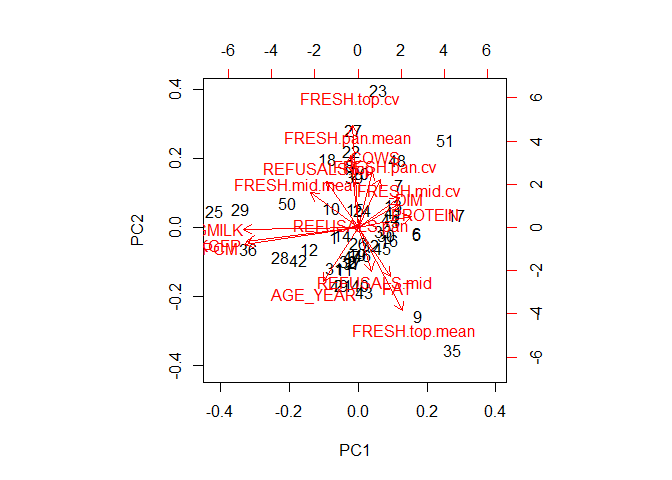<!-- -->

``` r
fviz_pca_var(DATASET2.pca, col.var = "black")
```

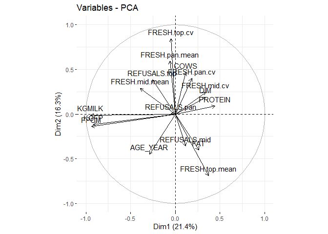<!-- -->

``` r
p <- fviz_pca_biplot(DATASET2.pca, label="none", invisible ="ind", col.var = "black", xlim=c(-8, 8), ylim=c(-8, 8))
p
```

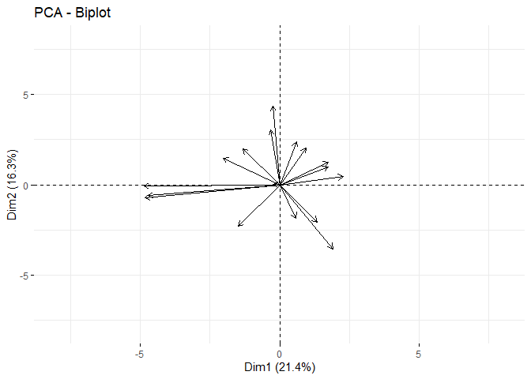<!-- -->

``` r
p <- p + annotate("text", x=-0.15, y=6.2, label=expression("FRESH"[TOP.CV]), size=3, angle=274) +
  annotate("text", x=-0.5, y=5.3, label=expression("FRESH"[PAN.MEAN]), size=3, angle=280) +
  annotate("text", x=0.8, y=3.5, label=expression("COWS"), size=3, angle=70) +
  annotate("text", x=1.5, y=3.5, label=expression("FRESH"[PAN.CV]), size=3, angle=55) +
  annotate("text", x=2.75, y=2.1, label=expression("FRESH"[MID.CV]), size=3, angle=20) +
  annotate("text", x=2.2, y=1.2, label=expression("DIM"), size=3, angle=18) +
  annotate("text", x=3, y=.7, label=expression("PROTEIN"), size=3, angle=10) +
  annotate("text", x=1.8, y=-2.5, label=expression("FAT"), size=3, angle=320) +
  annotate("text", x=2.7, y=-5, label=expression("FRESH"[TOP.MEAN]), size=3, angle=315) +
  annotate("text", x=1, y=-3.5, label=expression("REFUSALS"[MID]), size=3, angle=300) +
  annotate("text", x=-1.8, y=-2.8, label=expression("AGE"), size=3, angle=50) +
  annotate("text", x=-6, y=-.8, label=expression("FPCM; KGFP"), size=3, angle=5) +
  annotate("text", x=-5.7, y=0, label=expression("KGMILK"), size=3, angle=0) +
  annotate("text", x=-1.7, y=0.5, label=expression("REFUSALS"[PAN]), size=3, angle=0) +
  annotate("text", x=-3.2, y=2.3, label=expression("FRESH"[MID.MEAN]), size=3, angle=345) +
  annotate("text", x=-2.2, y=3.5, label=expression("REFUSALS"[TOP]), size=3, angle=320)

p <- p + labs(x = "PC1 (21.4%)", y = "PC2 (16.3%)")
p
```

    ## Warning in is.na(x): is.na() applied to non-(list or vector) of type
    ## 'expression'
    
    ## Warning in is.na(x): is.na() applied to non-(list or vector) of type
    ## 'expression'
    
    ## Warning in is.na(x): is.na() applied to non-(list or vector) of type
    ## 'expression'
    
    ## Warning in is.na(x): is.na() applied to non-(list or vector) of type
    ## 'expression'
    
    ## Warning in is.na(x): is.na() applied to non-(list or vector) of type
    ## 'expression'
    
    ## Warning in is.na(x): is.na() applied to non-(list or vector) of type
    ## 'expression'
    
    ## Warning in is.na(x): is.na() applied to non-(list or vector) of type
    ## 'expression'
    
    ## Warning in is.na(x): is.na() applied to non-(list or vector) of type
    ## 'expression'
    
    ## Warning in is.na(x): is.na() applied to non-(list or vector) of type
    ## 'expression'
    
    ## Warning in is.na(x): is.na() applied to non-(list or vector) of type
    ## 'expression'
    
    ## Warning in is.na(x): is.na() applied to non-(list or vector) of type
    ## 'expression'
    
    ## Warning in is.na(x): is.na() applied to non-(list or vector) of type
    ## 'expression'
    
    ## Warning in is.na(x): is.na() applied to non-(list or vector) of type
    ## 'expression'
    
    ## Warning in is.na(x): is.na() applied to non-(list or vector) of type
    ## 'expression'
    
    ## Warning in is.na(x): is.na() applied to non-(list or vector) of type
    ## 'expression'
    
    ## Warning in is.na(x): is.na() applied to non-(list or vector) of type
    ## 'expression'

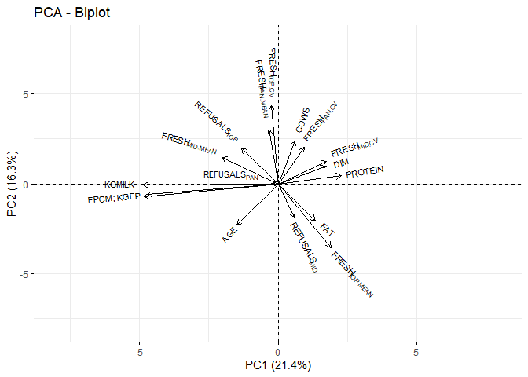<!-- -->

``` r
g <- fviz_pca_biplot(DATASET2.pca, geom=c("point", "text"), invisible = "var" , col.ind = "contrib",
             gradient.cols = c("#00AFBB", "#E7B800", "#FC4E07"), xlim=c(-8, 8), ylim=c(-8, 8))
g <- g + labs(x = "PC1 (21.4%)", y = "PC2 (16.3%)")
print (g)
```

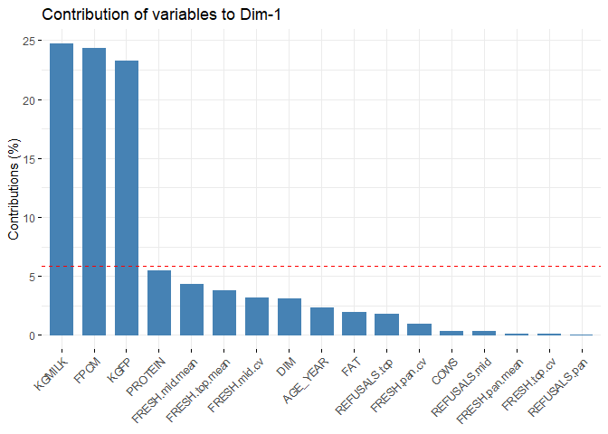<!-- -->

``` r
DATASETLAST <- DATASET2[-c(4,34), ]

fviz_pca_biplot(DATASET2.pca, geom=c("point", "text"), habillage = DATASETLAST$SPOILAGE, palette = c("#00AFBB", "#FC4E07"), addEllipses = TRUE, invisible = "var", col.var = "black")
```

    ## Too few points to calculate an ellipse

    ## Warning: Removed 1 rows containing missing values (geom_point).
    
    ## Warning: Removed 1 rows containing missing values (geom_point).

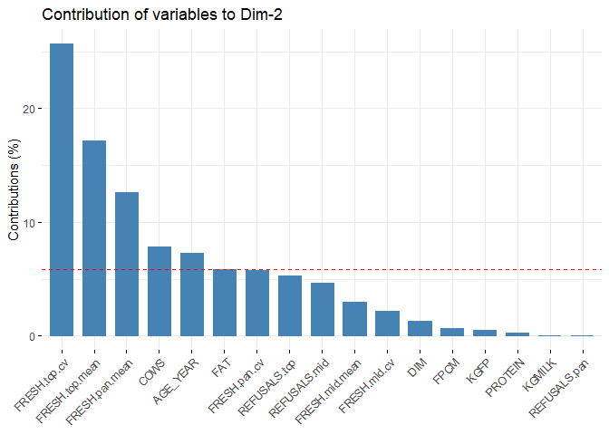<!-- -->

``` r
library(devtools)

install_github("vqv/ggbiplot", force=TRUE)
```

    ## Downloading GitHub repo vqv/ggbiplot@master

    ## WARNING: Rtools is required to build R packages, but is not currently installed.
    ## 
    ## Please download and install Rtools 3.5 from http://cran.r-project.org/bin/windows/Rtools/.

    ##   
      
      
       checking for file 'C:\Users\matth\AppData\Local\Temp\RtmpIBsqor\remotes17f434ab7f7e\vqv-ggbiplot-7325e88/DESCRIPTION' ...
      
       checking for file 'C:\Users\matth\AppData\Local\Temp\RtmpIBsqor\remotes17f434ab7f7e\vqv-ggbiplot-7325e88/DESCRIPTION' ... 
      
    v  checking for file 'C:\Users\matth\AppData\Local\Temp\RtmpIBsqor\remotes17f434ab7f7e\vqv-ggbiplot-7325e88/DESCRIPTION' (2.5s)
    ## 
      
      
      
    -  preparing 'ggbiplot':
    ## 
      
       checking DESCRIPTION meta-information ...
      
       checking DESCRIPTION meta-information ... 
      
    v  checking DESCRIPTION meta-information
    ## 
      
      
      
    -  checking for LF line-endings in source and make files and shell scripts
    ## 
      
      
      
    -  checking for empty or unneeded directories
    ## 
      
      
      
    -  looking to see if a 'data/datalist' file should be added
    ## 
      
      
      
    -  building 'ggbiplot_0.55.tar.gz'
    ## 
      
       
    ## 

    ## Installing package into 'C:/Users/matth/Documents/R/win-library/3.6'
    ## (as 'lib' is unspecified)

``` r
library(ggbiplot)
```

    ## Loading required package: plyr

    ## 
    ## Attaching package: 'plyr'

    ## The following object is masked from 'package:matrixStats':
    ## 
    ##     count

    ## Loading required package: scales

    ## Loading required package: grid

``` r
g <- ggbiplot(DATASET2.pca, choices = c(1,2), obs.scale = 1, var.scale = 1)
g <- g + geom_point(aes(size = DATASETLAST$FPCM, color = DATASETLAST$SPOILAGE))
g <- g + theme(legend.direction = 'horizontal', 
               legend.position = 'top')
g <- g + theme_minimal()
print(g)
```

<!-- -->

``` r
g <- ggbiplot(DATASET2.pca, choices = c(1,2), obs.scale = 1, var.scale = 1, var.axes=FALSE) +
  geom_point(aes(size = DATASETLAST$FPCM, color = DATASETLAST$SPOILAGE)) +
  theme(legend.direction = 'horizontal', legend.position = 'top') +
  scale_size_continuous(name = "FPCM (kg)") +
  scale_color_manual(values = c("#00AFBB", "#FC4E07"), name = "Spoilage") +
  labs(x = "PC1 (21.4%)", y = "PC2 (16.3%)") + 
  theme_minimal()
print(g)
```

    ## Warning: Removed 1 rows containing missing values (geom_point).

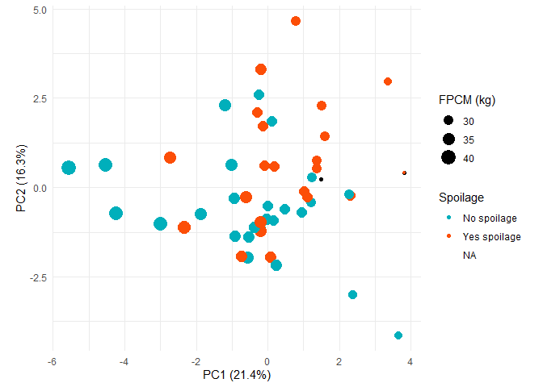<!-- -->

``` r
fviz_pca_biplot(DATASET2.pca, geom=c("point", "text"), habillage = DATASETLAST$POSITION, palette = c("#FC4E07", "#00AFBB"), addEllipses = TRUE, invisible = "var", col.var = "black")
```

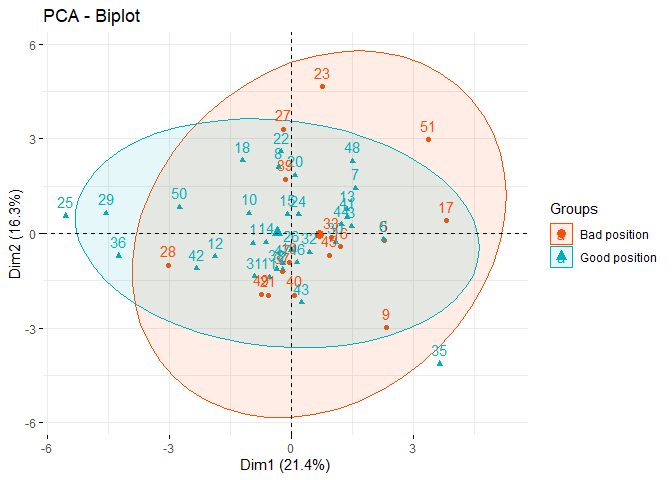<!-- -->

``` r
g <- ggbiplot(DATASET2.pca, choices = c(1,2), obs.scale = 1, var.scale = 1, var.axes=FALSE) +
  geom_point(aes(size = DATASETLAST$FPCM, color = DATASETLAST$POSITION)) +
  theme(legend.direction = 'horizontal', legend.position = 'top') +
  scale_size_continuous(name = "FPCM (kg)") +
  scale_color_manual (values = c("#FC4E07", "#00AFBB"), name = "Position", 
                      breaks=c("Good position", "Bad position")) +
  labs(x = "PC1 (21.4%)", y = "PC2 (16.3%)") + 
  theme_minimal()
print(g)
```

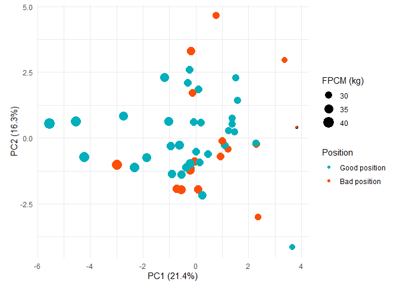<!-- -->

``` r
fviz_pca_biplot(DATASET2.pca, geom=c("point", "text"), habillage = DATASETLAST$MIXING_AFTER_LAST , addEllipses = TRUE, ellipse.type = "confidence", invisible = "var", label = "ind" , col.var = "black")
```

    ## Warning: Computation failed in `stat_conf_ellipse()`:
    ## missing value where TRUE/FALSE needed

    ## Warning: Removed 1 rows containing missing values (geom_point).
    
    ## Warning: Removed 1 rows containing missing values (geom_point).

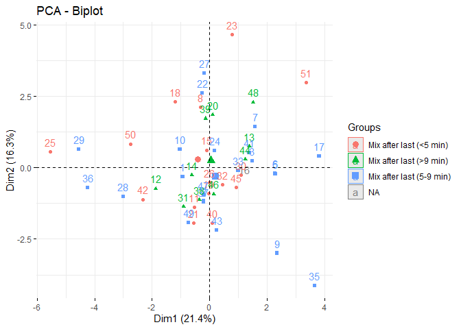<!-- -->

``` r
fviz_pca_biplot(DATASET2.pca, geom=c("point", "text"), habillage = DATASETLAST$MOVEMENT, addEllipses = TRUE, ellipse.type = "confidence", label = "ind" , invisible = "var", col.var = "black")
```

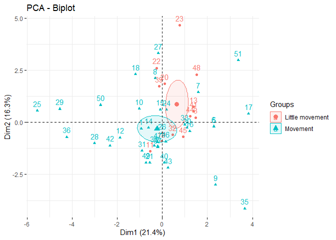<!-- -->
